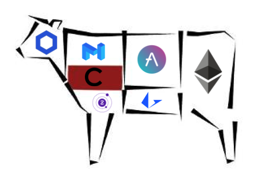

    

## Primechoice Select

A blockchain application that helps automatically select the best blockchain to facilitate a given transaction based on the requirements of the payment.

### Sponsors

- Chainlink
- Tellor
- Skale
- Torus
- Starkware (Cairo)
- ZkSync

## References:

Zksync:

- https://github.com/matter-labs/zksync/tree/master/sdk/zksync.js

Celer:
x

<!--
https://github.com/austintgriffith/scaffold-eth#%EF%B8%8F-quick-start
-->

### Running the project

Run the following services/commands in different terminal windows starting from the root directory of this project:

1. Install dependencies when running for the first time:
   `yarn`

2. Start local chain:
   `yarn chain`

3. Deploy smart contract
   `yarn deploy`

4. Start client website:
   `yarn start`

If successful Primechoice Select should now be ready and available on `localhost:3000`

### Selecting network

- Update `defaultNetwork` in hardhat.config.js in hardhat package>
- Update `TARGET_NETWORK_NAME` in constants.js in react package.

<!--
### Demo
1. Want to collect a payment with optimal fees
2. Create as one time or subscription Payment (choose subscription), ask for example tokens.
3. Generate a url - url can be shared with the buyer or on your website.
4.
-->
